**Spis treści**


- [Wojciech Nowak](#wojciech-nowak)
    - [Sprzęt](#sprzet)
    - [Wersje oprogramowania](#wersje-oprogramowania)
- [Zadania 1](#zadania-1)
    - [Zadanie 1a](#zadanie-1a)
        - [MongoDB](#mongodb)
            - [2.6](#2.6)
            - [2.8.0-rc0](#2.8.0-rc0)
            - [2.8.0-rc0 z WiredTiger](#2.8.0-rc0-z-wiredtiger)
            - [summary](#summary)
        - [PostgreSQL](#PostgreSQL)
    - [Zadanie 1b](#Zadanie-1b)
    - [Zadanie 1c](#Zadanie-1c)
    - [Zadanie 1d](#Zadanie-1d)
- [Zadanie 2](#Zadanie-2)
    - [Agregacja 1](#Agregacja-1)
        - [JS](#JS)
        - [Python](#Python)
    - [Agregacja 2](#Agregacja-2)
        - [JS](#JS)
        - [Python](#Python)
    - [Agregacja 3](#Agregacja 3)
        - [JS](#JS)
        - [Python](#Python)
    - [Agregacja 4](#Agregacja 4)
        - [JS](#JS)
        - [Python](#Python)

# Wojciech Nowak 
* nr albumu 206354 Informatyka I rok Magisterskie

####Sprzęt
* procesor: 

		Model:								  Intel Core i7-4650U
		Szybkość procesora:					1,7 GHz  
		Łączna liczba rdzeni:					2    
		Pamięć podręczna L2 (na rdzeń): 	  256KB    
		Pamięć podręczna L3: 				 4MB
		
* pamięć ram:

		Rozmiar: 		8GB 
		Typ:			DDR3
		Prędkość:	   1600MHz

* dysk: 

		model: 			SSD Samsung sm0256f 
		magistrala:		PCIe SSD
		
####Wersje oprogramowania
* MongoDB shell version: 	
        2.8.0-rc0
        2.6
* WiredTiger: 	            1.4.2
* Postgresql version: 		9.3.5
* OS: Mac OS X 				10.10 (14A389)
* Python:
       3.4.2
       2.7.8


#Zadania 1

###Zadanie 1a 
Polega na zaimportowaniu, do systemów baz danych uruchomionych na swoim komputerze, danych z pliku Train.csv bazy:

####MongoDB

komenda:

	>> time mongoimport --type csv -c Train --file Desktop/Train.csv --headerline

jednak:

	>>db.Train.findOne()

	{
		"_id" : ObjectId("5463ddb4ab50c94d02a24f07"),
		"Id" : "<p>Is there a way to check if the uploaded file is an image apart from checking the file extension using PHP?</p>"
	}
	
po krótkiej analizie co jest problemem, dochodzimy do wniosku, że należy usunąć "\n"

	>> time cat Train.csv | tr "\n" " " | tr "\r" "\n" > Train_prepared_for_mongoimport.csv
	real	19m42.573s
	user	37m9.401s
	sys		0m38.146s
	
######możemy na nowo wywołać import 2.6
	
	>>time mongoimport --type csv -c Train --file Train_prepared_for_mongoimport.csv --headerline
	connected to: 127.0.0.1
	2014-11-13T01:27:39.002+0100 		Progress: 44715137/7253917400     0%
	...
	2014-11-13T01:35:26.016+0100 		Progress: 7212784202/7253917400	99%
	2014-11-13T01:35:26.016+0100 			6000000  12765/second
	2014-11-13T01:35:28.844+0100 check 9 6034197
	2014-11-13T01:35:28.898+0100 imported 6034196 objects

	real	7m52.488s
	user	2m25.171s
	sys	0m26.896s
	
######możemy na nowo wywołać import 2.8.0-rc0
	
	>>time mongoimport --type csv -c Train --file Train_prepared_for_mongoimport.csv --headerline
	2014-11-17T01:45:04.590+0100	imported 6034196 documents

	real	6m49.952s
	user	6m16.081s
	sys	0m53.392s
	

######teraz 2.8.0-rc0 z włączonym WiredTiger

    >>time mongoimport --type csv -c Train --file Train_prepared_for_mongoimport.csv --headerline
	2014-11-19T18:30:10.829+0100	imported 6034196 documents

    real	4m19.000s
    user	5m57.282s
    sys	1m2.356s


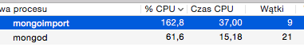


######Mongo.db imports

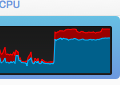


| 2.6       | 2.8.0-rc0 | 2.8.0-rc0 with WiredTiger |
|-----------|:---------:|--------------------------:|
| 7m52.488s | 6m49.952s |                 4m19.000s |
    

####PostgreSQL

najpierw użyjemy exportu z mongo do json'a

	>> time mongoexport --db test --collection Train --out train.json --journal
	2014-11-17T00:14:50.951+0100	exported 6034196 records

	real	5m46.904s
	user	2m55.293s
	sys		0m36.245s
	
tworzymy bazę

	>> createdb Train

włączamy hstora

	>> psql Train	
	
	>> CREATE EXTENSION hstore;

tworzymy tabele

	CREATE TABLE train (
    	Id int,
	    Title text,
    	Body text,
	    Tags text[],
	);

import w pythonie z mongodb -> postgresa:

[python script](import/mongo2postgres.py)	
	
	>> time python mongo2postgres.py
	real	68m41.412s
	user	10m26.866s
	sys	6m58.740s	


###Zadanie 1b
Zliczyć liczbę zaimportowanych rekordów (Odpowiedź: powinno ich być 6_034_195).
	
	>> mongo
	> db.Train.count()
	6034196
	
###Zadanie 1c
Zamiana formatu danych.) Zamienić string zawierający tagi na tablicę napisów z tagami następnie zliczyć wszystkie tagi i wszystkie różne tagi.
	
	>>time python3 tags_to_list_v0.py 
	All tags 17407667
	All distinct 42048

	real    71m5.795s
	user    47m8.053s
	sys     3m53.134s

[slow version Link](import/tags_to_list_v0.py)
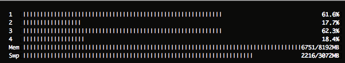
	
Zbyt wolno :(, dodatkowo robiłem budowanie słownika ale głównym spowolnieniem było nie zastosowanie zrównolegniania.
	
Uznałem, że da się dużo lepiej używając greenletów:

	>> time python tags_to_list_v1.py 
	real    32m16.310s
	user    9m25.584s
	sys     0m57.192s

[greenlet Link](import/tags_to_list_v1.py)
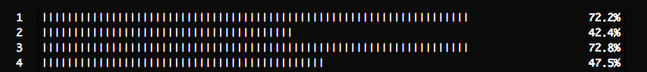

| tags_to_list_v0       | tags_to_list_v1.py |
|-----------------------|:------------------:|
| 71m5.795s             | 32m16.310s         |

###Zadanie 1d
Zadanie 1d. Wyszukać w sieci dane zawierające obiekty GeoJSON. Następnie dane zapisać w bazie MongoDB.

Szukając danych geojson, natrafiłem na bazę punktów poi. Postanowiłem zanalizować rejestratory w polsce.
[link do pliku](http://www.poiplaza.com/download/zipfiles/1424/PL-FixSpeedcam_mio_moov.zip)

	
przykładowy rekord:

	52.64373, 19.19789, 50@ PL-Modzerowo Fix Speedcam
	
musimy przygotowac do importu do mongodb

1. usunąć polskie znaki

		>> iconv -f utf8 -t utf8 -c PL-speedcam.csv > PL-speedcam_ASCII.csv
	
2. usunąć " ", "@", "PL-", "Fix Speedcam", nazwę miasta oraz podzielić przecinkami

		>> cat PL-speedcam_ASCII.csv | cut -d "@" -f1 > PL-speedcam_toImport.csv

3. import do mongodb

		>>time mongoimport --type csv -c speedcam --file PL-speedcam_toImport.csv --fields lon,lat,speed
		2014-11-17T04:29:26.515+0100	connected to: localhost
		2014-11-17T04:29:26.589+0100	imported 2538 documents

		real	0m0.106s
		user	0m0.034s
		sys	0m0.018s
		
4. przykładoy wpis:

		>>db.speedcam.findOne()
		{
			"_id" : ObjectId("54696b964fa64c9a2a9113fe"),
			"lon" : 52.88185,
			"lat" : 21.32492,
			"speed" : 50
		}
		
5. musimy przemienić go na geojson'a
	

```python
# -*- coding: utf-8 -*-
# CREATED ON DATE: 17.11.14
__author__ = 'vojtek.nowak@gmail.com'


import csv,json, decimal, codecs

file = open("PL-speedcam_toImport.csv")
reader = csv.reader(file, delimiter=",", quotechar='"')

keys = ['lon', 'lat', 'speed']

with codecs.open("speedcamGeo.json", "w", encoding="utf-8") as out:
    for r in reader:
        line = dict(zip(keys, r))

        out.write(json.dumps({
            'speed': int(line.get('speed')),
            'loc': [float(line.get('lon')), float(line.get('lat'))]
        })+"\n")

file.close()
```
	
	>> python csv2geojson.py


6. import do mongodb
	
		>>time mongoimport --type json -c speedcam --file speedcamGeo.json
		2014-11-17T04:53:24.583+0100	connected to: localhost
		2014-11-17T04:53:24.615+0100	imported 2538 documents

		real	0m0.042s
		user	0m0.033s
		sys	0m0.008s
		

AGREGACJE GEOJSON:

Napisałem skrypt [Link](speedcam/csv2geojson.py) w pythonie generujący geojsony dla zapytania do bazy mongodb:

	def to_geo_json_points(cursor, json_name, type="Point"):
    	geo_json = {
        	"type": "FeatureCollection",
	        "features": [
    	        {
        	        "type": "Feature",
            	    "geometry":
                	    {
                   	     "_id": str(point.get('speed')) + " " + str(point.get('loc')),
                   	     "type": type,
                   	     "coordinates": [point.get('loc')[1], point.get('loc')[0]]
                   	 }
	            } for point in cursor
    	    ]
	    }
	
    with open(json_name, 'w') as out_json:
        json.dump(geo_json, out_json)

1. fotoradary w całej Polsce.
	[Link](speedcam/speed_cams_poland.geojson)
	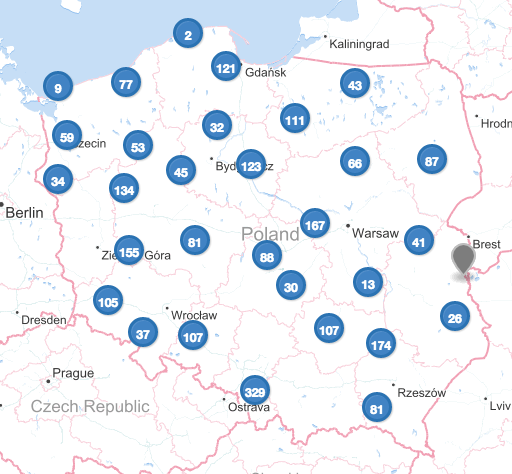
	
		>> to_geo_json_points(
	    cursor=db.speedcam.find(),
    	json_name='speed_cams_poland.geojson')	
    	    	
2. fotoradary w okolicy Gdańska.
	[Link](speedcam/speed_cams_near_gdansk.geojson)
	
	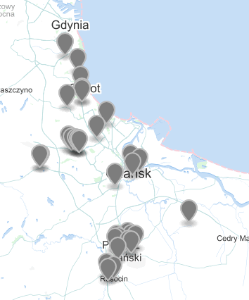
	
		>> to_geo_json_points(
	    cursor=db.speedcam.find({
    	    'loc': {
        	    '$near': {'$geometry': {'type': "Point", 'coordinates': [54.349683, 18.643335]}, '$maxDistance': 20000}}}),
	    json_name='speed_cams_near_gdansk.geojson')

    	
3. fotoradary w Pomorskim.
	[Link](speedcam/speed_cams_pomorskie.geojson)
	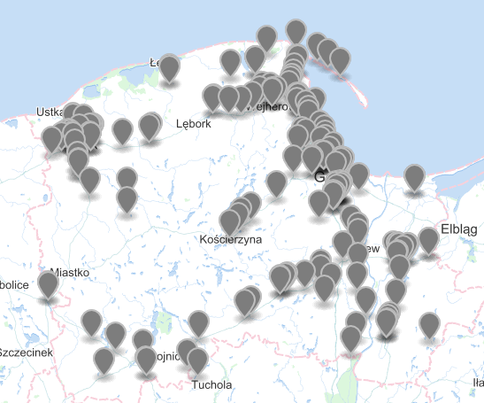
	
		>> to_geo_json_points(
    	cursor=db.speedcam.find({
        	'loc': {
            	'$geoIntersects': {
                	'$geometry': {
                   	 'type': "Polygon",
                   	 'coordinates': [
                   	     [
                   	         [54.570489, 16.702425],
                   	         [54.950828, 19.201752],
                   	         [53.611260, 19.310739],
                   	         [53.611260, 16.893747],
           	                 [54.570489, 16.702425]
                        ]
                    ]
                }
            }
        }
	    }),
    	json_name='speed_cams_pomorskie.geojson')	
4. speedcams near Karkow < 100
	[Link](speedcam/speed_cams_around_krakow.geojson)
	
	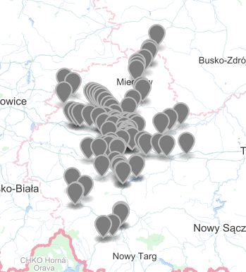
	
		>>to_geo_json_points(
	    cursor=db.speedcam.find({
    	    'loc': {
        	    '$near': {'$geometry': {'type': "Point", 'coordinates': [50.059441, 	19.940328]}}}}).limit(100),
    	json_name='speed_cams_around_krakow.geojson')    	
    	
5. fotoradary w na drodze.
	[Link](speedcam/speed_cams_route.geojson)  

		>>to_geo_json_points(
    			cursor=db.speedcam.find({
        		'loc': {'$geoIntersects':
            		        {'$geometry':
                		         {
                   		          'type': "LineString",
                       	      'coordinates': [
                   	    	          [52.64373, 19.19789],
                   	        	      [51.17473, 19.46548]
	                   	          ]
    	               	      }
        	           	 }
	        	}
	    	}),
		    json_name='speed_cams_route.geojson')


6. speedcams near Warsaw but not in warsaw center 4km < center < 20km
	[Link](speedcam/speed_cams_around_center_of_warsaw.geojson)
	
	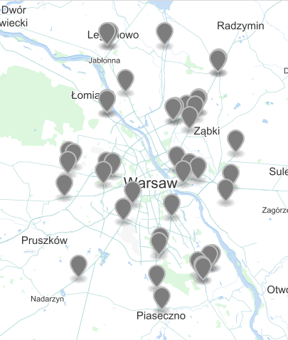

		>>to_geo_json_points(
    	cursor=db.speedcam.find({
        	'loc': {
            '$near': {'$geometry': {'type': "Point", 'coordinates': [52.232728, 21.010382]}, 	'$maxDistance': 20000, '$minDistance': 4000}}}),
    	json_name='speed_cams_around_center_of_warsaw.geojson')


7. speedcams 15 around polish seaside
	[Link](speedcam/speed_cams_near_seaside.geojson)
	
	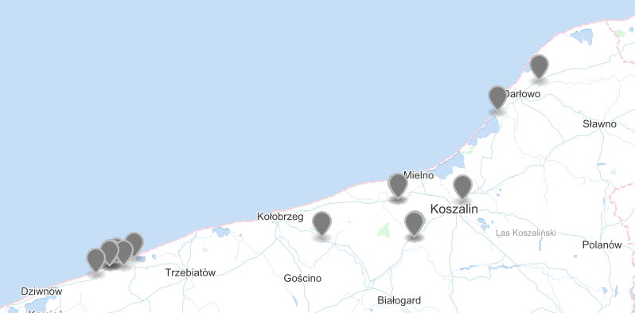
	
		>>to_geo_json_points(
    	cursor=db.speedcam.find({
        	'loc': {
            '$near': {
                '$geometry': {
                    'type': "Point",
                    'coordinates': [55.634283, 15.403922]
                }
            }
        }
	    }).limit(15),
    	json_name='speed_cams_near_seaside.geojson')
	
#Zadanie 2

dane pochodzą z [http://data.police.uk/data/ 
](http://data.police.uk/data/) z ostatniego roku tzn. 09.2013 - 09.2014

połączenie csv

	>> cat 201*/*.csv >merged.csv

zakładana liczba rekordów

	>>cat merged.csv | wc -l
	10 277 390
	
import do bazy mongodb

	>> time mongoimport --type csv -c crime --file merged.csv --headerline
	2014-11-19T03:29:58.883+0100	imported 10277389 documents

	real	4m47.820s
	user	8m29.818s
	sys		1m2.077s
	
test ilości

	>> db.crime.count()
	10277389
	
przykładowy wpis:

	>> > db.crime.findOne()
	{
	"_id" : ObjectId("546bff87fe4798e24132403f"),
	"Crime ID" : "15939afdf6964e9edea28bb0ba7aa3cb684fe879726910bf03945b3f8ceb85a3",
	"Month" : "2013-09",
	"Reported by" : "Avon and Somerset Constabulary",
	"Falls within" : "Avon and Somerset Constabulary",
	"Longitude" : "",
	"Latitude" : "",
	"Location" : "No location",
	"LSOA code" : "",
	"LSOA name" : "",
	"Outcome type" : "Suspect charged as part of another case"
	}

###Agregacja 1
ilość zakończeń przestępstwa w danym typie.
	
	
####JS	
		>>db.crime.aggregate(
        	[
    	        {
	                '$group': {
                	    '_id':  "$Outcome type",
            	        'count': {'$sum': 1}
        	        }
    	        },
	            {
                	'$sort': {'count': -1}
            	}
        	])
        time: 64.59 sec.
        
####Python 
skrypt z generowaniem słownika do highcharts [link](crime/aggregation1.py)


        >>time python aggregation1.py 
        real    1m1.465s
        user    0m0.070s
        sys     0m0.067s


[Interactive Chart](http://jsfiddle.net/bmrhL57u/2/)	
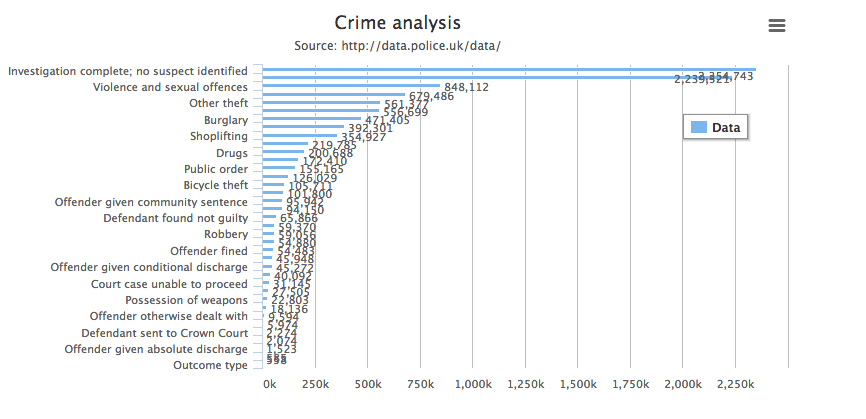

        	
###Agregacja 2
ilość przestępstw w danym miesiącu.

####JS	
		>>>>db.crime.aggregate([
        	{
                '$group': {
                    '_id':  "$Month",
                    'count': {'$sum': 1}
                }
        	},
            {
                '$sort': {'count': -1}
            }
		])
        time: 56.883 sec.
        
####Python 
skrypt z generowaniem słownika do highcharts [link](crime/aggregation2.py)


        >>time python aggregation2.py 
        real    0m57.950s
        user    0m0.076s
        sys     0m0.067s


[Interactive Chart](http://jsfiddle.net/bmrhL57u/3/)	
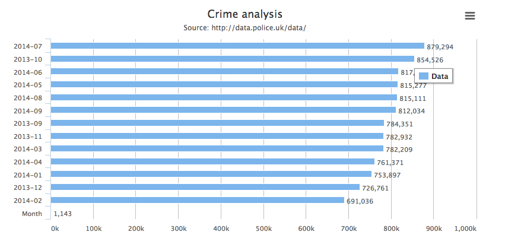
		
		
[
    {
        "_id" : "2014-09",
        "count" : 812034
    },
    {
        "_id" : "2014-06",
        "count" : 817447
    },
    {
        "_id" : "2014-07",
        "count" : 879294
    },
    {
        "_id" : "2014-05",
        "count" : 815277
    },
    {
        "_id" : "2013-12",
        "count" : 726761
    },
    {
        "_id" : "2014-03",
        "count" : 782209
    },
    {
        "_id" : "2014-04",
        "count" : 761371
    },
    {
        "_id" : "2014-01",
        "count" : 753897
    },
    {
        "_id" : "2014-08",
        "count" : 815111
    },
    {
        "_id" : "2013-10",
        "count" : 854526
    },
    {
        "_id" : "2014-02",
        "count" : 691036
    },
    {
        "_id" : "2013-09",
        "count" : 784351
    },
    {
        "_id" : "2013-11",
        "count" : 782932
    }
]


###Agregacja 3
kiedy dawano uniewinnienie?

####JS	
		>>db.crime.aggregate([
        { '$match' : { 'Outcome type' : "Offender given absolute discharge" }},
        {
                '$group': {
                    '_id':  "$Month",
                    'count': {'$sum': 1}
                }
        },
        {
            '$sort': {'count': -1}
        }
        ])
        time: 48.487 sec.
        
####Python 
skrypt z generowaniem słownika do highcharts [link](crime/aggregation3.py)


        >>time python aggregation3.py 
        real    0m51.672s
        user    0m0.078s
        sys     0m0.069s

[Interactive Chart](http://jsfiddle.net/bmrhL57u/4/)	
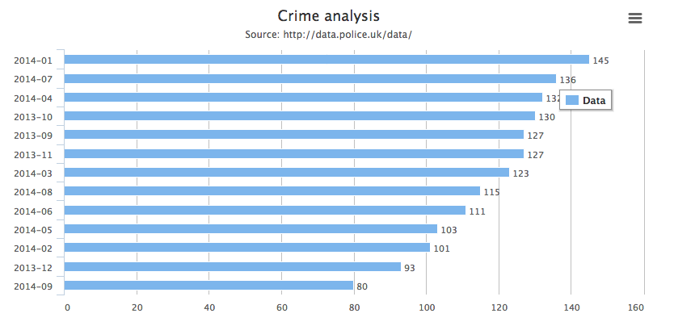

[
    {
        "_id" : "2014-01",
        "count" : 145
    },
    {
        "_id" : "2014-07",
        "count" : 136
    },
    {
        "_id" : "2014-04",
        "count" : 132
    },
    {
        "_id" : "2013-10",
        "count" : 130
    },
    {
        "_id" : "2013-09",
        "count" : 127
    },
    {
        "_id" : "2013-11",
        "count" : 127
    },
    {
        "_id" : "2014-03",
        "count" : 123
    },
    {
        "_id" : "2014-08",
        "count" : 115
    },
    {
        "_id" : "2014-06",
        "count" : 111
    },
    {
        "_id" : "2014-05",
        "count" : 103
    },
    {
        "_id" : "2014-02",
        "count" : 101
    },
    {
        "_id" : "2013-12",
        "count" : 93
    },
    {
        "_id" : "2014-09",
        "count" : 80
    }
]

###Agregacja 4
Uniewinnienia i ich lokalizacje

####JS	
		>>db.crime.aggregate([
        { '$match' : { 'Outcome type' : "Offender given absolute discharge" }},
        {
                '$group': {
                    '_id':  "$Location",
                    'count': {'$sum': 1}
                }
        },
        {
            '$sort': {'count': -1}
        },
        {
            '$limit': 10
        }
	    ])
        time: 49.382 sec.
        
####Python 
skrypt z generowaniem słownika do highcharts [link](crime/aggregation4.py)


        >>time python aggregation4.py 
        real    0m49.514s
        user    0m0.078s
        sys     0m0.082s

	
[Interactive Chart](http://jsfiddle.net/bmrhL57u/5/)	
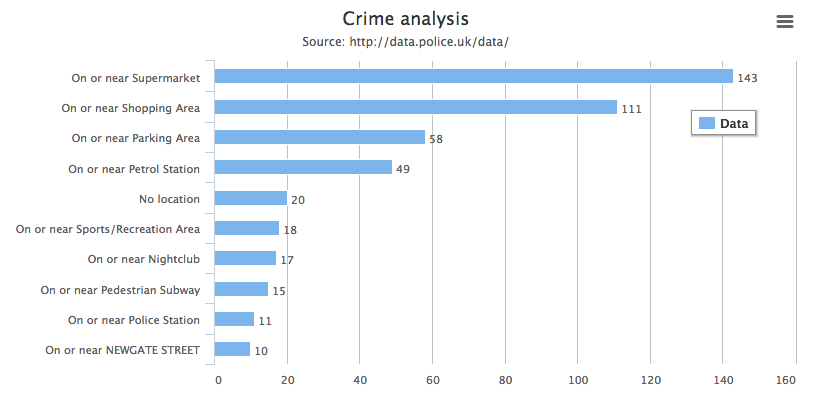
	
		[
    {
        "_id" : "On or near Supermarket",
        "count" : 143
    },
    {
        "_id" : "On or near Shopping Area",
        "count" : 111
    },
    {
        "_id" : "On or near Parking Area",
        "count" : 58
    },
    {
        "_id" : "On or near Petrol Station",
        "count" : 49
    },
    {
        "_id" : "No location",
        "count" : 20
    },
    {
        "_id" : "On or near Sports/Recreation Area",
        "count" : 18
    },
    {
        "_id" : "On or near Nightclub",
        "count" : 17
    },
    {
        "_id" : "On or near Pedestrian Subway",
        "count" : 15
    },
    {
        "_id" : "On or near Police Station",
        "count" : 11
    },
    {
        "_id" : "On or near NEWGATE STREET",
        "count" : 10
    }
]


